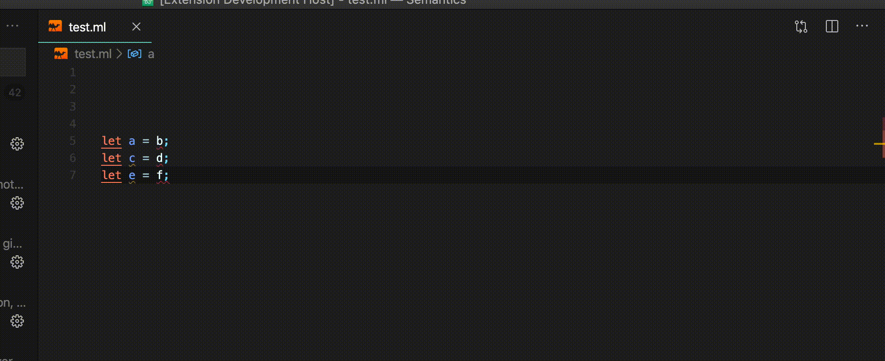

# Comby for VSCode

This is a prototype implementation for an extension that allows to execute Comby in VSCode.

VScode doesn't allow to beautifully reimplement a search-like extension. What can be done in the action bar is very limited (tree views only).

This is using codelens to preview rewrites, but this is not an optmized way of doing things.

## Features

- Match and replace elements one by one.

   
  
   

- More coming up.

## Requirements

Have comby installed and available in the path.

## Extension Settings

No settings for now
<!-- 
## Known Issues

Calling out known issues can help limit users opening duplicate issues against your extension. -->

## Roadmap

- [x] Match elements given a query
- [x] Replace elements after previously matching
- [ ] Button to replace all elements
- [ ] Add configuration for custom path to comby
- [ ] Handle where rules
- [ ] Execute pre-written scripts
- [ ] Handle multi-file rewrites. (VSCode doesn't support webviews in the action bar yet).